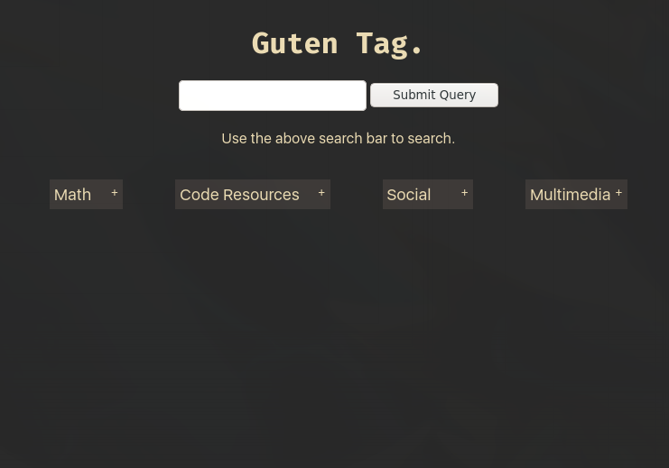
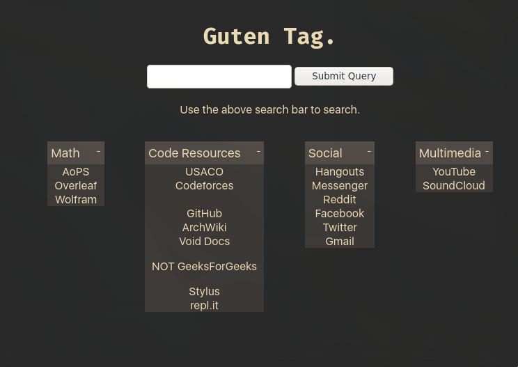

# firefox-startpage
just the webpage that opens when i open up firefox

big big thanks to chezbgone for showing how to into HTML, because i couldn't have done any of the menu functions without him

